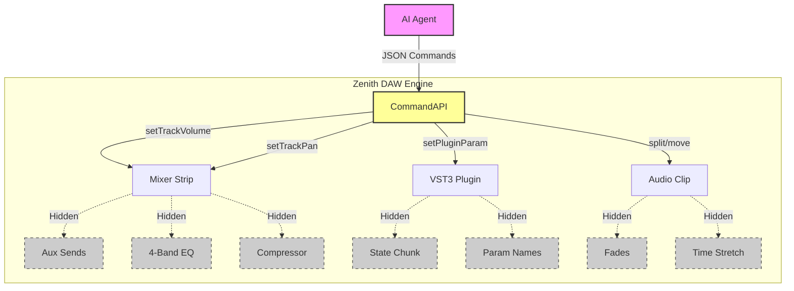
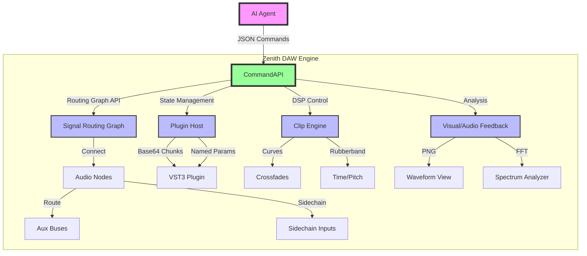
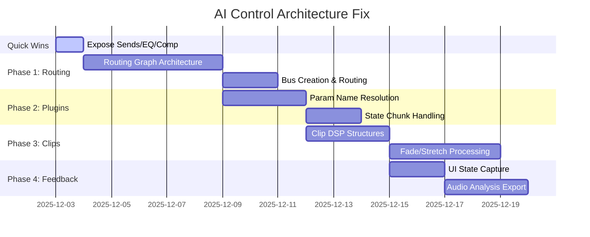

# AI Control Architecture Diagram

## Current State: "The Remote Control"
The AI is external to the system, poking at surface-level parameters.

---

## Desired State: "The Brain Interface"
The AI has deep access to the signal graph, plugin states, and DSP pipeline.

## Implementation Roadmap

