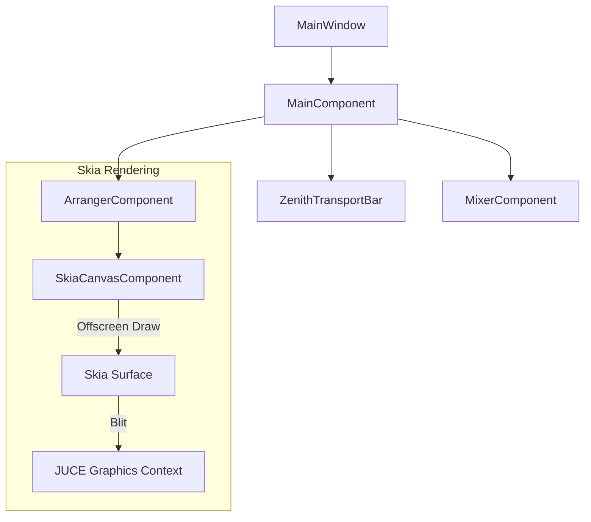

# Zenith Architecture Overview

> **Source of Truth**: Any significant engine or threading change MUST update this doc before merge.

## Introduction

Zenith is a high-performance, cross-platform Digital Audio Workstation (DAW) built with **C++20**, **JUCE**, and **Skia**. It is designed for professional audio production, offering a responsive UI and a robust, real-time audio engine.

This document outlines the high-level architecture, separating the concerns of the audio engine, the user interface, and the data model.

## High-Level Architecture

Zenith follows a strict separation between the **Real-Time Audio Engine** and the **Application Logic/UI**.

```mermaid
graph TD
    User[User Interaction] --> UI[UI Layer (JUCE/Skia)]
    UI --> CommandAPI[Command API]
    CommandAPI --> ProjectState[Project State (Data Model)]
    ProjectState -- Updates --> UI
    ProjectState -- Sync --> Engine[Audio Engine]
    Engine --> AudioIO[Audio I/O (ASIO/CoreAudio)]
    Engine --> Plugins[VST3 Plugins]
```

### 1. The Audio Engine (`zenith-core/include/Engine.h`)
The `Engine` is the heart of Zenith. It runs on a high-priority real-time thread.
- **Responsibility**: Processing audio buffers, handling MIDI events, and managing the audio graph.
- **Constraints**: strictly **wait-free** and **lock-free**. No memory allocation (`malloc`/`new`) or system calls (I/O) are allowed in the audio callback.
- **Components**:
    - **Graph**: A node-based audio processing graph.
    - **Transport**: Manages playhead position, tempo, and time signature (`TempoMap`).
    - **Plugin Host**: Hosts VST3 instruments and effects.

⚠️ **Critical**: If you add anything that touches the audio thread, verify it against the [Real-Time Rules Table](contributing.md#real-time-safety-critical) before merging.

### 2. The Data Model (`zenith-core/include/ProjectState.h`)
The `ProjectState` holds the source of truth for the session.
- **Responsibility**: Serializing/deserializing projects, managing tracks, clips, and automation data.
- **Thread Safety**: Accessed primarily by the Message Thread. Updates are synchronized to the Engine via lock-free queues or double-buffered state patterns.

### 3. The UI Layer (`zenith-core/Source/ui`)
The UI is built using a hybrid approach:
- **JUCE**: Handles windowing, event loop, and standard widgets.
- **Skia**: Used for high-performance, custom rendering of complex components (e.g., Piano Roll, Waveforms).

## UI Architecture: JUCE + Skia

Zenith uses Skia to render complex visualizations that require high frame rates and anti-aliasing quality that exceeds standard JUCE `Graphics`.



### Skia Integration Strategy
- **Offscreen Rendering**: Skia renders to an offscreen `SkSurface`.
    - *Rationale*: Avoids the synchronization overhead and thread-blocking issues often seen with direct JUCE OpenGL integration.
- **Integration**: The resulting image is drawn to the JUCE component during the `paint()` callback.
- **Interaction**: JUCE handles mouse/keyboard events, which are translated into actions within the Skia-rendered view.

## Project Structure

| Directory | Description |
|-----------|-------------|
| `zenith-core/include` | Public headers for the core engine and data models. |
| `zenith-core/src` | Implementation of core logic. |
| `zenith-core/Source/ui` | UI components (JUCE and Skia-based). |
| `zenith-core/Source/commands` | Command pattern implementation for Undo/Redo. |
| `zenith-core/tests` | Unit and integration tests (GTest). |

## Data Flow

### 1. User Action (e.g., Move Clip)
1. User drags a clip in `ArrangerComponent`.
2. `ArrangerComponent` calls `CommandAPI::moveClip()`.
3. `CommandAPI` pushes a command to the `UndoManager`.
4. The command updates `ProjectState`.
5. `ProjectState` notifies listeners (UI repaints).
6. `ProjectState` synchronizes the change to the `Engine` (e.g., updating the playback graph).

### 2. Audio Playback
1. `Engine` receives an audio callback from the device.
2. `Engine` processes the audio graph (Tracks -> Plugins -> Master Bus).
3. `Engine` writes to the output buffer.
4. (Optional) Metering data is pushed to a lock-free FIFO for the UI to read.

## Key Classes

- **`Engine`**: The main audio engine controller.
- **`ProjectState`**: Root object for the session data.
- **`MainWindow`**: The main application window.
- **`ArrangerComponent`**: The main timeline view.
- **`ZenithTransportBar`**: Controls for playback and recording.
- **`SkiaTheme`**: Centralized styling (colors, fonts) for Skia components.
